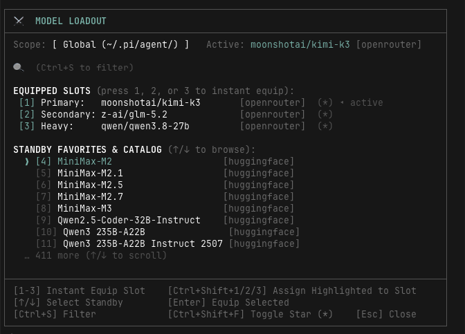

# ⚔️ pi-model-loadout

A video game–style **Weapon Loadout** (Quick Slots 1 / 2 / 3) and persistent favorites system for [`pi-coding-agent`](https://github.com/badlogic/pi-mono). Instantly switch between local engines (Unsloth/GGUF on Apple Silicon) and cloud providers (OpenRouter, Anthropic, Google) without touching `/model`.

```text
┌─────────────────────────────────────────────────────────────────────────────┐
│ ⚔️  MODEL LOADOUT                                                            │
├─────────────────────────────────────────────────────────────────────────────┤
│ Scope: [ Global (~/.pi/agent/) ]  Active: moonshotai/Kimi-K2 [huggingface]  │
│                                                                             │
│ 🔍 (Ctrl+S to filter)                                                       │
│                                                                             │
│ EQUIPPED SLOTS (press 1, 2, or 3 to instant equip):                         │
│ [1] Primary:   moonshotai/Kimi-K2-Instruct  [huggingface]  (*) ◂ active    │
│ [2] Secondary: (empty — Ctrl+Shift+2 on a standby row to assign)            │
│ [3] Heavy:     minimaxai/MiniMax-M2         [huggingface]  (*)             │
│                                                                             │
│ STANDBY FAVORITES & CATALOG (↑/↓ to browse):                                │
│ ❯ [4] MiniMaxAI/MiniMax-M2                  [huggingface]  (*)             │
│   [5] moonshotai/Kimi-K2-Instruct           [huggingface]  (*)             │
│   [6] MiniMax-M2.1                          [huggingface]                  │
│   … 413 more (↑/↓ to scroll)                                                │
├─────────────────────────────────────────────────────────────────────────────┤
│ [1-3] Instant Equip Slot     [Ctrl+Shift+1/2/3] Assign Highlighted to Slot │
│ [↑/↓] Select Standby         [Enter] Equip Selected                        │
│ [Ctrl+S] Filter              [Ctrl+Shift+F] Toggle Star (*)   [Esc] Close  │
└─────────────────────────────────────────────────────────────────────────────┘
```



## Installation

**Option A — drop into your global extensions directory (hot-reloadable):**

```bash
git clone https://github.com/prith-pal/pi-model-loadout.git ~/.pi/agent/extensions/pi-model-loadout
# then in pi: /reload
```

**Option B — as a pi package via settings.json:**

```json
{
  "packages": ["git:github.com/prith-pal/pi-model-loadout@v1"]
}
```

**Option C — quick test:**

```bash
pi -e ./pi-model-loadout/src/index.ts
```

## Usage

| Input | Action |
|---|---|
| `/loadout` or `/ml` | Open the Loadout HUD |
| `/loadout 1` | Instant-equip Slot 1 without opening the HUD (also `2`, `3`); empty slot = no-op |
| `/model <query>` | Equip directly; tab-completes your favorites/slots (bare `/model` opens pi's native picker) |
| `Ctrl+Shift+L` | Open the Loadout HUD from anywhere |

### Inside the HUD

| Key | Action |
|---|---|
| `1` / `2` / `3` | Instant-equip that slot and close |
| `↑` / `↓` | Move the highlighted row |
| `Enter` | Equip the highlighted row |
| `Ctrl+Shift+1` / `Ctrl+Shift+2` / `Ctrl+Shift+3` | Assign highlighted row to that slot (auto-stars it) |
| `Ctrl+Shift+F` | Toggle favorite `(*)` on the highlighted row (plain `F` also works) |
| `Ctrl+S` | Enter search mode |
| `Esc` | Close without changing anything |

#### Search mode

| Key | Action |
|---|---|
| *any printable char incl. digits* | Append to fuzzy filter (`3` in "kimi-k3" filters, not slot) |
| `Backspace` | Delete one char |
| `Ctrl+U` / `Ctrl+Backspace` | Clear the whole query |
| `↑` / `↓` / `Enter` / `Ctrl+Shift+1/2/3` / `Ctrl+Shift+F` | Operate on the filtered highlighted row |
| `Esc` | Clear query and exit to base mode; when query is empty, close the HUD |

## Session restore

On `session_start`, the extension re-applies your saved `activeModelId` (falling back to Slot 1) — zero manual setup after restart, `/new`, or `/resume`.

## Configuration

First match wins; writes go back to the file that was loaded.

| Scope | Path |
|---|---|
| Workspace | `.pi/pi-model-loadout.json` (in the active repo) |
| Global | `~/.pi/agent/pi-model-loadout.json` |

```json
{
  "activeModelId": "unsloth/Qwen3.8-27B-Instruct-GGUF",
  "slots": {
    "1": "unsloth/Qwen3.8-27B-Instruct-GGUF",
    "2": "openrouter/free",
    "3": "deepseek/deepseek-v4"
  },
  "favorites": [
    "unsloth/Qwen3.8-27B-Instruct-GGUF",
    "openrouter/free",
    "deepseek/deepseek-v4",
    "unsloth/Gemma-4-26B-A4B-GGUF"
  ],
  "customCatalog": [
    { "id": "unsloth/Qwen3.8-27B-Instruct-GGUF", "label": "Qwen 27B (local)" }
  ],
  "unslothBaseUrl": "http://127.0.0.1:8000"
}
```

- All model refs are `"provider/modelId"` and must resolve in pi's model registry (`pi --list-models`) with auth configured.
- `customCatalog[].label` overrides the display name; `customCatalog[].meta` is an optional free-form annotation shown in the right-hand HUD column. Pi's registry doesn't expose cost or tokens-per-second, so nothing is shown unless you write it yourself.
- Writes are atomic (tmp file + rename); corrupt files are treated as absent rather than crashing your session.

## Local Unsloth health check

If you equip an `unsloth/...` model and nothing answers on `http://127.0.0.1:8000/v1`, you'll get:

> ⚠️ Local Unsloth server not detected on :8000. Run 'unsloth serve' or 'unsloth start pi'.

The check is a 1.5s-timeout `GET /v1/models` and never blocks startup. If you don't use local models, it stays completely inert. Point it elsewhere with `unslothBaseUrl`.

## Development

```bash
bun install          # dev deps (typescript, @types/*)
bun test             # unit tests (config engine, slots, favorites)
bun run typecheck    # strict tsc --noEmit
```

### Project layout

```text
src/
├── index.ts           # Extension entrypoint: commands, shortcuts, session hooks
├── types.ts           # Config schema + model-ref helpers
├── config.ts          # Workspace/global resolution, atomic saves, mutations
├── ui/
│   ├── modal.ts       # Loadout HUD (ctx.ui.custom component + key handling)
│   └── modal.ts       # The entire Loadout HUD (one file now)
└── unsloth/
    └── health.ts      # localhost:8000/v1 health probe
test/
└── config.test.ts     # bun test suite
```

## License

MIT
